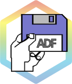

```{r, include = FALSE}
knitr::opts_chunk$set(
  collapse = TRUE,
  comment = "#>",
  fig.path = "man/figures/README-",
  out.width = "100%"
)
```

# adfExplorer

<!-- badges: start -->
[](https://github.com/pepijn-devries/adfExplorer/actions/workflows/R-CMD-check.yaml)
[](https://pepijn-devries.r-universe.dev/adfExplorer)
[](https://CRAN.R-project.org/package=adfExplorer)

<!-- badges: end -->



`adfExplorer` can be used to read from and write to virtual Amiga Disks, a.k.a
Amiga Disk Files (ADF).

## Installation

You can install the development version of adfExplorer from [r-universe](https://pepijn-devries.r-universe.dev/adfExplorer) with:

``` r
install.packages("adfExplorer", repos = c("https://pepijn-devries.r-universe.dev", "https://cloud.r-project.org"))
```

Or install the latest version from CRAN:

```r
install.packages("adfExplorer")
```

## Background

### Amiga Disk Files

The Commodore Amiga was a home computer that relied heavily on it's
build-in 3.5 inch floppy disk drive in the late eighties and early
nineties. The Amiga was a popular system which nowadays can 
be accurately [emulated](https://en.wikipedia.org/wiki/Amiga_emulation)
on modern machines. A problem with the emulation of the Amiga
is that most modern machines no longer have floppy disk drives.
And if they do, they are usually physically not able to read
Amiga formatted disks. To overcome this problem, the Amiga Disk File
(ADF) was created. Such files are a virtual representation of a
floppy disks which can be used in emulation.

#### Legal notes

Emulating the Commodore Amiga hardware is, as far as I can tell, legal.
However, the Amiga had its operating system stored on a read only memory
chip. Which is commonly referred to as the kickstart. This kickstart software
is still protected by copyright law. Licensed copies can be bought legally
from [AmigaForever](https://www.amigaforever.com). The same is true for much of the
Amiga software, which is still protected by copyright.

Note that for analysing ADF files with the `adfExplorer` package you don't
need the kickstart software. Just make sure the ADF files you use contain
data or software for which you own (or don't need) a licence. 

### The `adfExplorer` package

This package will allow you to analyse Amiga Disk Files (ADF) with
the R scripting language. It can also be used to transfer files
from and to ADF in batches, e.g. for preparing disks for emulation 
purposes.

The focus will be on the older Amiga operating systems (i.e.,
OS 3.x and less), as I am most familiar with those systems. In
newer versions floppy disks became less important anyway.
Note that this package cannot read extended ADF files containing
information on the disk's
[Modified Frequency Modulation (MFM)](https://en.wikipedia.org/wiki/Modified_Frequency_Modulation).
This information is typically only required for copy protected disks
and is therefore out of the scope of this package.

## Example

```{r example}
library(adfExplorer)

## First setup a connection to a virtual device
adz_file <- system.file("example.adz", package = "adfExplorer")
my_device <- connect_adf(adz_file)

## Open a connection to a file on the virtual device
fcon <- adf_file_con(my_device, "DF0:s/startup-sequence")

## Read from the file
my_startup <- readLines(fcon, warn = FALSE)

## Close the file
close(fcon)

## Close the virtual device
close(my_device)
```

## Acknowledgements

The `adfExplorer` package is an R interface around the [`ADFlib` library](https://github.com/lclevy/ADFlib).
The package would not have been possible without the work of Laurent Clévy,
Tomasz Wolak) and many other
[contributors](https://github.com/lclevy/ADFlib/blob/master/AUTHORS) of ADFlib.

## Code of Conduct
Please note that the adfExplorer project is released with a [Contributor Code of Conduct](https://contributor-covenant.org/version/2/1/CODE_OF_CONDUCT.html). By contributing to this project, you agree to abide by its terms.
