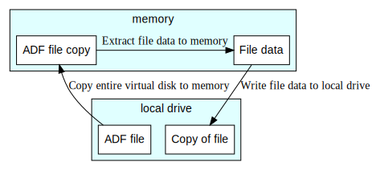
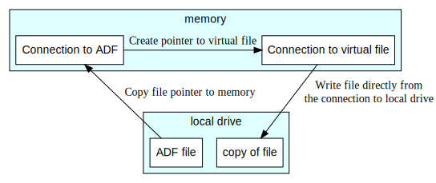
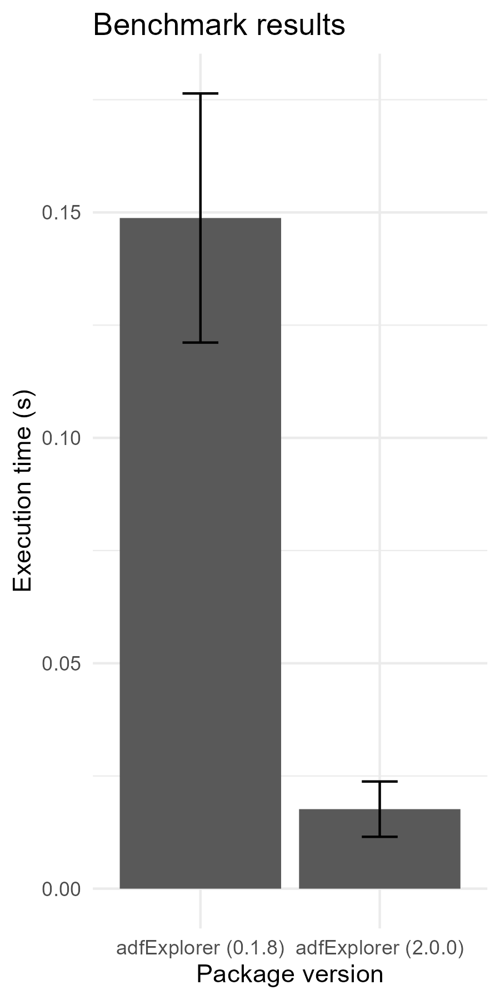

```{r, include = FALSE}
knitr::opts_chunk$set(
  collapse = TRUE,
  comment = "#>"
)
```
## Motivation for adfExplorer version 2

This vignette explains why version 2.0.0 was completely rewritten. It
will also provide some hands on examples showing how versions >=2.0.0
work differently from older versions and how you can modify your R code
when you are switching to the latest version.

Below version 2.0.0 everything was coded in `R`. Although, technically
a lot could be achieved, it was not very effective. In order to work with Amiga
Disk Files, the entire file first needed to be copied into memory, and than save
the object in memory back to disk after manipulation.

Consider the case where you want to extract a file from a virtual disk and store it
on your local drive. The schematics below show the process in the old situation.
The ADF file first needs to be copied to memory. The file data from that object needs
to be extracted from that copy. After which the file data can be stored to disk:



After working on this approach for a while, I learned about the existence of
[ADFlib](https://github.com/adflib/ADFlib). This is when I decided to start from scratch
and set up a more efficient design resulting in version 2.0.0. There I took the `C`
code from `ADFlib` and build an interface to `R` in `C++`. This strategy had several
advantages:

 * The wheel doesn't have to be reinvented, as `ADFlib` already implemented the
   core functionalities for interacting with Amiga Disk Files.
 * By coding in `C` and `C++`:
    * Custom `R` connections can be created. This allows you to modify the ADF
      files in place without having to copy them to memory first.
    * The program needs to be compiled

Because the new strategy doesn't need to move data back and forth to memory and
uses compiled code, it is much faster (see also the benchmark test below).

Furthermore, you can create connections to files on the virtual device and directly
read from or write to those files. There is no more need to create physical copies of
the virtual file.

The process of extracting a file from an ADF device with version 2.0.0 and up would look
something like this:




## Switching from version <2 to >=2

When you have code using `adfExplorer` versions below 2.0.0, I recommend switching
to a newer version at
your earliest convenience. Partly because of the reasons listed above, but also many
functions from the old release are deprecated. As versions of 2.0.0 and up use a different
syntax, I have put some examples side by side, to help you translate your code.

Let's start by opening a Amiga Disk File:

```{r opendisk}
adz_file <- system.file("example.adz", package = "adfExplorer")

# ---------------- adfExplorer
library(adfExplorer, warn.conflicts = FALSE)

# ---------------- Old code
# my_disk1 <- read.adz(adz_file)

# ---------------- New code
my_disk2 <- connect_adf(adz_file)

```

Show and change the current dir:

```{r curdir}
# ---------------- Old code
# current.adf.dir(my_disk1)
# current.adf.dir(my_disk1) <- "s"

# ---------------- New code
adf_directory(my_disk2)
adf_directory(my_disk2) <- "s"

```

List entries in a directory. Note that versions 2.0.0 and up have the capability to list the
entries recursively (in all nested subdirectories):

```{r listdir}
# ---------------- Old code
# list.adf.files(my_disk1, "DF0:")

# ---------------- New code
list_adf_entries(my_disk2, "DF0:", recursive = TRUE)

```

Read from a file on the virtual disk:
```{r fileread}
# ---------------- Old code
# get.adf.file(my_disk1, "startup-sequence") |>
#   rawToChar()

# ---------------- New code
con <- adf_file_con(my_disk2, "startup-sequence")
readLines(con, warn = FALSE)
close(con)
```

Clean up after yourself:

```{r cleanup}
# ---------------- Old code
# rm(my_disk1)

# ---------------- New code
close(my_disk2)
rm(my_disk2)
```

## Benchmarking version 0.1.8 against 2.0.0

A set of tasks were defined to evaluate computational time: open an ADF file;
show the current dir; set the current directory to a specific path; read a small
text file from the virtual device; list all dir and file entries on the disk's root.
The plot below shows the time it took to complete
these tasks with both version 0.1.8 and version 2.0.0. The latter is nearly 5 times
faster than the older version.

{width="300px"}
